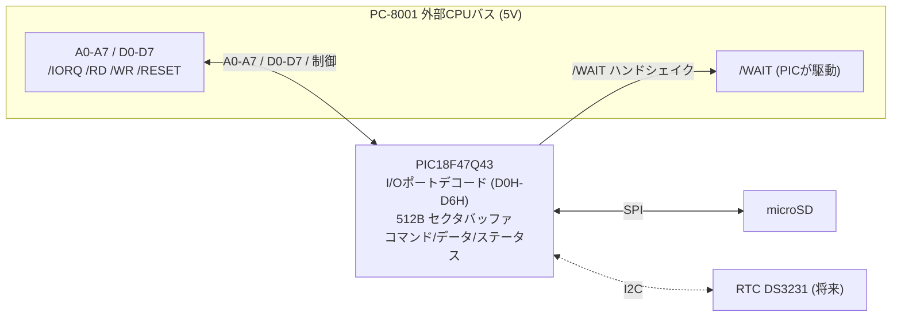

# PC8001extSDRTC

PC-8001 の外部CPUバスに直結する **PICマイコン式 SDカード + RTC ドライブ** の設計資料リポジトリです。

SDアクセスを、PC-8001 のCPU外部バスに接続した **PIC18F47Q43** に肩代わりさせ、SDカードを
**Z80 の I/O デバイス**として見せます。将来は I2C RTC(DS3231等)も同じデバイスに同居させます。

ソフト側(SD-DOS)から見ると、SDアクセス下回りのドライバ(`MMC.asm`)を I/O ポート版
(`MMC_PIC.asm`)に差し替えるだけで使えます。上位のファイルシステム層は無変更です。

- ソフト本体(SD-DOS): https://github.com/kuninet/SD-DOS
- I/O プロトコル仕様(最重要): [docs/protocol.md](docs/protocol.md)
- 兄弟プロジェクト(同じ外部バス直結の流儀): [PC8001ext232C](https://github.com/kuninet/PC8001ext232C)

> ⚠️ 本リポジトリは **設計段階**です。回路・基板・PICファームはこれから物理試作します。
> まずは I/O プロトコルと、SD-DOS 側のドライバ差し替え構成を固める段階です。

## なぜ作るのか(背景)

SD-DOS の SDアクセスは 8255 PPI を使った **ビットバンギング SPI** です。これは1セクタ
(512バイト)の読み出しに実機(Z80 実効約1.84MHz)で **約0.1秒**かかり、密に音符が並ぶ
VGM再生などでは「もたつき」が出ます(Issue #68 の割り込み駆動プレイヤ検証で、ソフトの
工夫では消せないと結論)。

そこで下回りを **ハードSPI(MHz級)を持つPIC**に置き換えると、1セクタ読みが **~0.5ms** 前後、
**約200倍**高速化します。同期読みのままでももたつかなくなり、割り込み背景読みのような
小細工も不要になります。

## 設計方針(A案: 生512Bブロックデバイス)

PIC は **「512バイト単位のランダムアクセス I/O デバイス」**に徹します。

- FAT 等のファイルシステムは **Z80(SD-DOS)側**のまま。PIC は生ブロックの R/W だけを担う。
- CP/M など他のソフトからも汎用的に使える(ファイルシステム非依存)。
- PIC は周辺を全エミュレートするのではなく、**I/O 周辺デバイスに徹する**。
  クロック・主ROM・主RAM は PC-8001 が供給する(EMUZ80 とは役割が逆)。

## アーキテクチャ



I/O ポートは PC-8001 未割り当ての拡張領域 **D0H-D6H** に割り当てます。
詳細は [docs/protocol.md](docs/protocol.md) を参照してください(SD-DOS と共有する契約)。

| ポート | R/W | 役割 |
|---|---|---|
| D0H | W | コマンド(0=READ, 1=WRITE, 2=STATUS, 3=INIT、将来RTC) |
| D1H-D4H | W | セクタアドレス 32bit(LSB→MSB) |
| D5H | R/W | データFIFO(512B セクタバッファ ストリーム入出力) |
| D6H | R | ステータス(bit0=READY, bit1=BUSY, bit7=ERROR) |

### タイミングの見積り

実効1.84MHz → 1 I/O サイクル ≒ 2.2μs。PIC を64MHzで回すと **約35命令ぶん**の猶予があり、
EMUZ80 の 1350ns/21命令より約5倍楽です。単純なレジスタ応答は /WAIT 無しでも届く見込みですが、
**/WAIT で安全マージンを取る**設計にします。遅いSD読み中(~0.5ms)はZ80を /WAIT で固めず、
ステータスを polling して待つ方式とし、N-BASIC の割り込みを止めません。

## PIC を PIC18F47Q43 にする理由

| 型番 | RAM | Flash | MaxMHz | CLC | 備考 |
|---|---|---|---|---|---|
| **PIC18F47Q43(採用)** | 8KB | 128KB | 64 | あり | 512Bバッファ後も余裕、EMUZ80 実績、SPI×2/I2C |
| PIC18F46K22 | 4KB | 64KB | 64 | なし | バッファは足りるが余裕減、デコード外付け要かも |
| PIC18F4550 以下 | ≤2KB | ≤32KB | ≤48 | なし | 512Bバッファでほぼ埋まる(非推奨) |

RAM 8KB は 512B セクタバッファ + 将来のダブルバッファ / FATキャッシュ余地に効きます。
CLC(Configurable Logic Cell)で I/O ポートデコードをハード化でき、応答に余裕が出ます。

## SD-DOS 側のビルド分け

SD-DOS は **ビットバンギング(既定)** と **PICSD** を同一ソースから作り分けます。

- `src/LABELS.asm` の `USE_PICSD EQU FALSE`(既定)を `TRUE` にすると PIC版になる。
- `src/MMC.asm`(8255ビットバンギング)/ `src/MMC_PIC.asm`(D0H-D6H I/O)を条件INCLUDEで切替。
- ビルド: 既定 `make` がビットバンギング、`make picsd` が PIC版(`build/MAIN-PICSD.cmt`)。

詳細は SD-DOS リポジトリを参照してください。

## ロードマップ

1. **/WAIT 実機検証(最優先)**: 最小PICで「D0H 読み書きエコー + /WAIT アサート/解除」だけ作り、
   PC-8001 外部バスが /WAIT を尊重するか実機確認する。
2. **PIC SDファーム**: SPI初期化 + CMD17/CMD24 でセクタ R/W、512Bバッファ、ステータス。
   ロジックアナライザで I/O プロトコルを確認する。
3. **SD-DOS `MMC_PIC.asm` 結合**: Mac側の回帰テストをフック差し替えで通し、実機で R/W。
4. **実機体感**: VGMPLAY で「もたつき消滅」を確認(本丸)。
5. **RTC フェーズ**: D0H コマンドに時計 R/W を追加、I2C DS3231 等。

## ディレクトリ構成

```
PC8001extSDRTC/
├── README.md          このファイル(設計概要)
├── Makefile           PC-8001側テスト(WAITTEST)ビルド / firmware構文チェック
├── tools/             外部ツール(tools80.jar を置く。本体は再配布しないため非コミット)
├── docs/
│   └── protocol.md    D0H-D6H I/O 仕様(SD-DOS と共有する契約。最重要)
├── hardware/
│   └── design.md      回路設計仕様・結線表・ピンアサイン・BOM
├── firmware/          PIC18F47Q43 ファーム(MPLAB X / XC8)。今は構成と関数スタブ
│   └── waittest/      /WAIT 検証用スタブ
└── test/              /WAIT ハンドシェイク検証(PC-8001側 WAITTEST.asm + 手順)
```

## ビルド

PC-8001 アセンブラ tools80.jar を `tools/` に置きます(入手方法は [tools/README.md](tools/README.md)。
ツール本体は再配布しないためリポジトリには含めません)。SD-DOS など他リポジトリには依存しません。

```sh
make            # build/WAITTEST.cmt(PC-8001側 /WAIT 検証)を生成
make fw-check   # firmware の C スタブをホストで構文チェック
```

別の場所の jar を使う場合は `make TOOLS80=/path/to/tools80.jar`。PIC ファーム本体の実機
ビルドは MPLAB X + XC8 で行います。

## 将来検討: PC-80S31(FD)互換モード

PIC+SD を PC-80S31(NEC純正フロッピーユニット)のホストインターフェースに似せれば、
無改造の N-BASIC DISK BASIC / NEC CP/M が動く可能性があります(膨大な .D88 資産が使える)。
ただし PC-80S31 は Z80+μPD765 を積んだ知的サブシステムで、互換ファームは A案の単純な
ブロックデバイスより遥かに重く、フロッピー意味論に制約されます。**当面は A案を主とし、
PIC がバス上にいる利点を活かして将来「モード」として追加し得る**設計に留めます。

## ライセンス

MIT License. [LICENSE](LICENSE) を参照してください。
