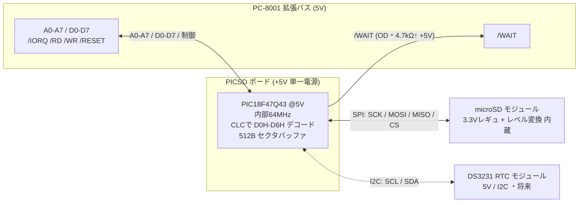

# PICSD 回路設計仕様・結線表(フェーズA)

PIC18F47Q43 を PC-8001 外部CPUバスに直結し、SDカードを D0H-D6H の I/O デバイスとして
見せるボードの設計仕様です。KiCad 入力前の「何をどう繋ぐか」を確定します。

> ✅ ピン番号・PPS 割り当て・I2C 専用 pin はデータシート(DS40002147E, Rev.E)で照合済み。
> 実機で詰める項目(/WAIT タイミング、I2C 標準レベル動作、バスバッファ要否)は §6 に分けています。

## 1. 基本方針

- **PIC は 5V 単一電源で動作させる**(PIC18F47Q43 は 5V 動作可)。
  - 理由: PC-8001 拡張バスは 5V TTL。PIC を 5V で回せば**バス側のレベル変換が一切不要**になり、
    部品点数が激減する(EMUZ80 と同じ思想)。
  - 3.3V が要るのは microSD だけ。これは **オンボードに 3.3V レギュレータ + レベル変換を持つ
    microSD モジュール**(既存 SD-DOS で使う [sdd](https://github.com/chiqlappe/sdd) 相当)を使い、
    SPI 信号は 5V ロジックのままモジュールに渡してモジュール内で整える。→ ボード上に個別の
    レベル変換ICを置かない。
  - RTC(将来)は DS3231 モジュール(5V トレラント、オンボード I2C プルアップ)を想定し、
    I2C も 5V のまま接続。
- **クロックは内部 64MHz HFINTOSC**。水晶不要(→ OSC ピンを GPIO に回せる)。
- I/O ポートデコード(`A7..A0 == D0H..D6H` かつ `/IORQ`)は **CLC でハード化**して応答を詰める。
  SPI/CLC のピンは PPS で自由に割り当て可能。

### レベル変換まとめ

| 境界 | 信号 | 方式 |
|---|---|---|
| PC-8001 ↔ PIC | A0-A7, D0-D7, /IORQ, /RD, /WR, /RESET, /WAIT | **変換なし**(両側 5V) |
| PIC ↔ microSD | SPI(SCK/MOSI/MISO/CS) | **microSDモジュールのオンボード変換**に委ねる |
| PIC ↔ RTC(将来) | I2C(SCL/SDA) | **変換なし**(DS3231 モジュールが 5V 対応) |

> 補足: 個別 microSD ソケットを使う場合は、別途 3.3V レギュレータ(AMS1117-3.3 等)+
> 4ch レベル変換(TXS0108/TXB0104 等)が必要。本仕様は**変換内蔵モジュール前提**で簡素化する。

## 2. ブロック図

## 3. ピンアサイン(PIC18F47Q43 / PDIP-40)

> ✅ **データシート照合済み**(DS40002147E, Rev.E)。ピン番号は Figure 2-3「40-Pin PDIP」/
> Table 3-2「40/44/48-Pin Allocation Table」の **40-Pin PDIP 列**と一致。

ポート割り当ての考え方:
- **アドレス A0-A7 は PORTC にまとめる**(1命令で読めてデコードが速い)。こうすると **PORTB が丸ごと空き**、
  ICSP の RB6/RB7 に拡張バス信号を一切載せずに済む(=書込競合を構造的に排除)。
- SPI/I2C は空いた **PORTB(RB0-RB5)** に PPS で配置。RB6/RB7 は **ICSP 専用**にする。
- データ D0-D7 は **PORTD**、制御は **PORTA**。内部発振のため OSC1/OSC2(RA7/RA6)は予備。

| pin | ポート | 割り当て | 方向 | 備考 |
|---|---|---|---|---|
| 1 | RE3/MCLR/VPP | MCLR | in | 10kΩ プルアップ + リセット回路(ICSP VPP 兼用) |
| 2 | RA0 | /IORQ | in | 拡張バス。デコード/CLC入力 |
| 3 | RA1 | /RD | in | 拡張バス。データ方向制御 |
| 4 | RA2 | /WR | in | 拡張バス。書込ストローブ |
| 5 | RA3 | /RESET | in | 拡張バス(PIC初期化トリガにも) |
| 6 | RA4 | /WAIT | out(OD) | **オープンドレイン**。4.7kΩで+5VへWired-OR |
| 7 | RA5 | (予備) | - | 拡張用 |
| 8 | RE0 | (予備) | - | |
| 9 | RE1 | (予備) | - | |
| 10 | RE2 | (予備) | - | |
| 11 | VDD | +5V | pwr | 0.1µF パスコン |
| 12 | VSS | GND | pwr | |
| 13 | RA7/OSC1 | (予備) | - | 内部発振のため空き |
| 14 | RA6/OSC2 | (予備) | - | 同上 |
| 15 | RC0 | A0 | in | アドレスバス |
| 16 | RC1 | A1 | in | |
| 17 | RC2 | A2 | in | |
| 18 | RC3 | A3 | in | 本来I2C専用pinだがアドレス入力に使用(GPIOとして問題なし) |
| 19 | RD0 | D0 | bidir | データバス |
| 20 | RD1 | D1 | bidir | |
| 21 | RD2 | D2 | bidir | |
| 22 | RD3 | D3 | bidir | |
| 23 | RC4 | A4 | in | 本来I2C専用pinだがアドレス入力に使用(GPIOとして問題なし) |
| 24 | RC5 | A5 | in | アドレスバス |
| 25 | RC6 | A6 | in | |
| 26 | RC7 | A7 | in | |
| 27 | RD4 | D4 | bidir | データバス |
| 28 | RD5 | D5 | bidir | |
| 29 | RD6 | D6 | bidir | |
| 30 | RD7 | D7 | bidir | |
| 31 | VSS | GND | pwr | |
| 32 | VDD | +5V | pwr | 0.1µF パスコン |
| 33 | RB0 | SD_SCK | out | SPI1 SCK(PPSで割当) |
| 34 | RB1 | SD_MOSI(SDO1) | out | SPI1 SDO(PPSで割当) |
| 35 | RB2 | SD_MISO(SDI1) | in | SPI1 SDI(PPSで割当) |
| 36 | RB3 | SD_CS | out | GPIO(CS手動制御)。リセット時デセレクト用にプルアップ推奨 |
| 37 | RB4 | RTC_SCL | out(OD) | I2C(PPSで割当)・標準STレベル・将来 |
| 38 | RB5 | RTC_SDA | bidir(OD) | I2C(PPSで割当)・標準STレベル・将来 |
| 39 | RB6 | ICSPCLK | - | **ICSP専用**。アプリ未使用。FWで**内部**弱プルアップ(WPUB)を有効にしフロート回避。外付け抵抗は載せない(PGC/PGD への負荷はNG) |
| 40 | RB7 | ICSPDAT | - | 同上 |

割り当ての要点:
- **A0-A7 = PORTC**(入力)。1命令で読めてデコードが速い。`D0H-D6H` 判定は A7..A3=11010、A2..A0=ポート選択。
  RC3/RC4 は本来 I2C 専用 pin だが、ここではアドレス入力として使用(通常 GPIO として問題なし)。
- **D0-D7 = PORTD**(双方向)。`IN` 時のみ TRIS を出力に切り替えてドライブ。
- **制御線 = PORTA**(RA0-RA4)。/WAIT は RA4 を ODCON でオープンドレイン。
- **SPI = RB0-RB3**(SCK/MOSI/MISO/CS)。SCK1/SDO1/SDI1 は PPS 再配置可なので RB0-RB2 へ。CS は GPIO(RB3)。
- **I2C = RB4/RB5**(将来 RTC)。PPS で割当。ただし I2C 専用ロジックレベルを持つ pin は **RC3/RC4 のみ**
  (Table 3-2 Note 4)で、それらはアドレスに使うため、I2C は**標準 TTL/ST レベル**での動作になる。
  低速・1デバイス・モジュール側プルアップ前提なら実用上問題ないが、実機で確認(§6)。
- **ICSP = RB6/RB7**(+ MCLR/VDD/VSS)。**拡張バス信号を一切載せない**配置なので、PC-8001 に挿したままでも
  抜いても**書込競合なし**(ジャンパ不要)。アプリ動作中 RB6/RB7 は ICSP ヘッダにしか繋がらないため、
  FW で**内部**弱プルアップ(WPUB)を有効にしてフロートを避ける(PGC/PGD に**外付け**プルアップは載せない)。

## 4. 結線表(ネット単位)

### 4.1 PC-8001 拡張バス ↔ PIC

| ネット | PC-8001 拡張バス | PIC(pin) | 備考 |
|---|---|---|---|
| A0 | A0 | RC0(15) | アドレスバス |
| A1 | A1 | RC1(16) | |
| A2 | A2 | RC2(17) | |
| A3 | A3 | RC3(18) | |
| A4 | A4 | RC4(23) | |
| A5 | A5 | RC5(24) | |
| A6 | A6 | RC6(25) | |
| A7 | A7 | RC7(26) | |
| D0 | D0 | RD0(19) | 双方向 |
| D1 | D1 | RD1(20) | 双方向 |
| D2 | D2 | RD2(21) | 双方向 |
| D3 | D3 | RD3(22) | 双方向 |
| D4 | D4 | RD4(27) | 双方向 |
| D5 | D5 | RD5(28) | 双方向 |
| D6 | D6 | RD6(29) | 双方向 |
| D7 | D7 | RD7(30) | 双方向 |
| /IORQ | /IORQ | RA0(2) | デコード/CLC入力 |
| /RD | /RD | RA1(3) | データ方向制御 |
| /WR | /WR | RA2(4) | 書き込みストローブ |
| /RESET | /RESET | RA3(5) | |
| /WAIT | /WAIT | RA4(6) | OD出力、4.7kΩ↑+5V |
| +5V | +5V | VDD(11,32) | |
| GND | GND | VSS(12,31) | |

> データバス保護/駆動強化のため **74LVC245 を D0-D7 に挟む案**もある(向きは /RD・デコード出力で
> 制御)。まずは PIC 直結で試作し、必要なら追加する。

### 4.2 PIC ↔ microSD モジュール

| ネット | PIC(pin) | microSDモジュール | 備考 |
|---|---|---|---|
| SD_SCK | RB0(33) | CLK/SCK | SPIクロック |
| SD_MOSI | RB1(34) | CMD/DI/MOSI | |
| SD_MISO | RB2(35) | DAT0/DO/MISO | |
| SD_CS | RB3(36) | CS/DAT3 | リセット時デセレクト用に 10kΩ↑+5V 推奨 |
| +5V | VDD | VCC | モジュール内で3.3V生成 |
| GND | VSS | GND | |

### 4.3 PIC ↔ RTC モジュール(将来)

| ネット | PIC(pin) | DS3231モジュール | 備考 |
|---|---|---|---|
| RTC_SCL | RB4(37) | SCL | I2C(PPS割当・標準STレベル)。モジュール側プルアップ有 |
| RTC_SDA | RB5(38) | SDA | I2C(PPS割当・標準STレベル) |
| +5V | VDD | VCC | |
| GND | VSS | GND | |

## 5. BOM(暫定)

| # | 部品 | 型番/値 | 数 | 備考 |
|---|---|---|---|---|
| 1 | マイコン | PIC18F47Q43-I/P(PDIP-40) | 1 | 5V動作・内部64MHz |
| 2 | microSD モジュール | 3.3Vレギュ+レベル変換内蔵タイプ | 1 | sdd 相当 |
| 3 | RTC モジュール(将来) | DS3231(電池付) | 1 | I2C・5V対応 |
| 4 | データバスバッファ(任意) | 74LVC245 | 0-1 | 直結で不足時に追加 |
| 5 | パスコン | 0.1µF セラミック | 2-3 | 各VDD近傍 |
| 6 | バルクコンデンサ | 10µF | 1 | 電源安定 |
| 7 | プルアップ(/WAIT) | 4.7kΩ | 0 | **PC-8001 母板側でプルアップ済みのためボード側は不要**(OD Wired-OR) |
| 8 | プルアップ(MCLR) | 10kΩ | 1 | Figure 4-1 R1 |
| 9 | 直列抵抗(MCLR) | 100〜470Ω | 1 | Figure 4-1 R2(ICSP保護) |
| 10 | パスコン(MCLR) | 0.1µF | 1 | Figure 4-1 C2 |
| 11 | プルアップ(I2C, 将来) | 4.7kΩ ×2 | 0-2 | モジュールに有れば不要 |
| 12 | プルアップ(SD_CS, 任意) | 10kΩ | 0-1 | 起動直後の SD 誤選択防止 |
| 13 | ICソケット | 40pin DIP | 1 | |
| 14 | 拡張バスコネクタ | PC-8001 拡張バス対応 | 1 | 232C/sdd 流用 |
| 15 | ICSPヘッダ | 5pin(MCLR/VDD/VSS/RB6/RB7) | 1 | PICKit等で書込。RB6/RB7はアプリ未使用なのでバス競合なし |
| 16 | ピンヘッダ | モジュール接続用 | 適量 | |

## 6. データシート照合の結果と残課題

### 照合済み(DS40002147E)
- ✅ **PDIP-40 ピン番号**: Figure 2-3 / Table 3-2 の 40-Pin PDIP 列と本表が一致。
- ✅ **SPI の PPS 割当**: SCK1/SDO1/SDI1 は PPS 再配置可能(Table 3-2 Note 1/2)。RB0-RB2 を選択。
- ✅ **I2C 専用レベル pin**: 本パートで I2C 専用ロジックレベルを持つのは **RC3/RC4 のみ**(Table 3-2 Note 4)。
  他ピンも PPS で SCL/SDA を割り当て可能だが、入力レベルは I2C/SMBus 専用しきい値ではなく
  **標準 TTL/ST**(INLVL で選択)になる、とデータシート本文で確認。本設計は RC3/RC4 をアドレスに
  使うため、I2C(RB4/RB5)は標準 ST レベル動作。
- ✅ **電源/MCLR**: VDD=11,32 / VSS=12,31 / MCLR=1。Figure 4-1 の推奨(10kΩ↑+100〜470Ω直列+0.1µF)。
- ✅ **ICSP 競合の構造排除**: RB6/RB7 に拡張バス信号を載せない配置とし、書込時のバス競合を回避。

### 実機で詰める(フェーズB)
1. **/WAIT のタイミング**(最優先): 1サイクル ~2.2μs 内に OD アサート/解除が間に合うか(ロジアナ実測)。
   → 最小プログラム `../test/WAITTEST.asm` + `../firmware/waittest/` で先に検証。
2. **データバス直結 vs 74LVC245**: PIC の駆動能力・バス容量で判断。まず直結で試作。
3. **I2C 標準レベル動作の確認**(RTC フェーズ): DS3231 を 5V・モジュールプルアップで接続し、
   標準 ST しきい値で安定通信するか。不安定なら専用レベル pin を使う別配置やバスバッファを再検討。
4. **SD_CS のリセット時デセレクト**: 起動直後 RB3 が入力(Hi-Z)の間に SD が誤選択されないか。
   必要なら CS プルアップ(BOM #12)で抑える。
5. **拡張バスの /WAIT ピン**: /WAIT は **PC-8001 母板側でプルアップ済み**(確認済み)なのでボード側プルアップは不要。
   OD で Low/解放のタイミングが効くかを実機で確認(項目1と一緒に)。

## 7. 関連

- I/O プロトコル(D0H-D6H): [../docs/protocol.md](../docs/protocol.md)
- /WAIT 検証: [../test/](../test/)
- データシート: PIC18F27/47/57Q43(Microchip DS40002147E)
- ハードウェア親Issue: #4 / PICSD: #1
- 同じ外部バス直結ボードの先例: [PC8001ext232C](https://github.com/kuninet/PC8001ext232C)
