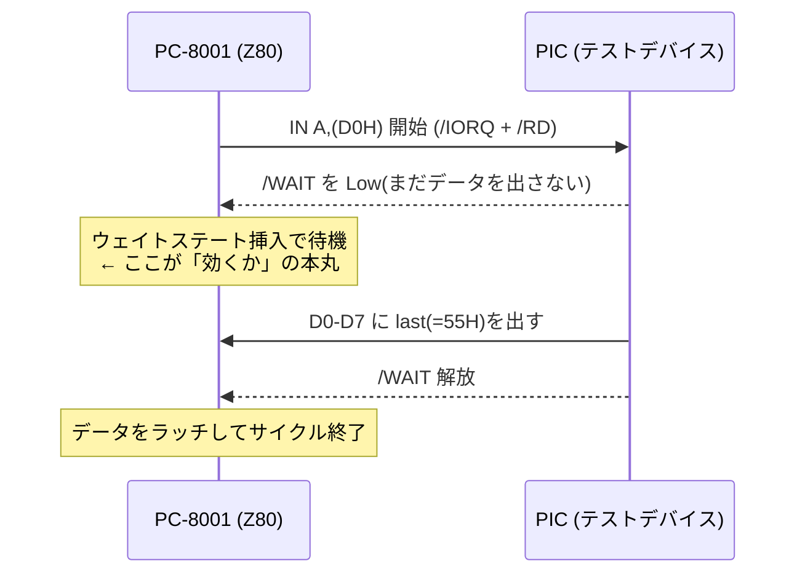

# test — /WAIT ハンドシェイク検証

PICSD ボードの最初の関門「**PC-8001 拡張バスが /WAIT を尊重するか**」を、SD/RTC 抜きの
最小構成で確かめるための一対のプログラムです(Issue #1 の最優先タスク)。

| ファイル | 側 | 役割 |
|---|---|---|
| [`WAITTEST.asm`](WAITTEST.asm) | PC-8001(Z80) | テストポートを `IN`/`OUT` し、結果を表示 |
| [`../firmware/waittest/waittest.c`](../firmware/waittest/waittest.c) | PIC18F47Q43 | わざと遅れて応答し、その間 /WAIT を下げるスタブ |

## 仕組み

PIC を**意図的に遅く**します(/WAIT を Low → 数µs 待つ → データを出す → /WAIT 解放)。



- **/WAIT が効いていれば**: Z80 は待ってから読むので、読み値は常に正しい(`55H`)。
- **/WAIT が効いていなければ**: Z80 が待たずに読むので、ゴミ値になる。

## 契約(両者で一致させる値)

- テストポート = **D0H**(WAITTEST は 9003H POKE で変更可)
- PIC 内部レジスタ `last`(電源投入時 = **55H**)
- READ → `last` を返す / WRITE → `last` に格納(どちらも /WAIT で整流)

## ビルドと実行

### PC-8001 側(WAITTEST.asm)
tools80(j80 付属)でアセンブルします。`tools/tools80.jar` を置けば(入手方法は
[../tools/README.md](../tools/README.md))、リポジトリ直下で:

```sh
make                     # build/WAITTEST.cmt を生成
# 別パスの tools80 を使う場合:
make TOOLS80=/path/to/tools80.jar
```

手で叩く場合:

```sh
printf 'OK\n' | java -jar tools/tools80.jar -tgt=z80 test/WAITTEST.asm
```

`.asm` は Shift-JIS です。生成した `WAITTEST.cmt` を実機へ LOAD し、モニタで **G9000** で起動します。

### PIC 側(waittest.c)
MPLAB X + XC8。`firmware/waittest/waittest.c` のスタブ関数(バス信号の捕捉・/WAIT 駆動・
データバス方向)を実機ピンに合わせて実装します。ピン割り当ては
[`../hardware/design.md`](../hardware/design.md) を参照。

## 結果の読み方

画面表示: `RD=xx NG=nnn WR=yy`

| 表示 | 意味 | 成功 |
|---|---|---|
| `RD` | テストポートの最初の読み値 | `55` |
| `NG` | 256回読んで `55H` と一致しなかった回数 | `000` |
| `WR` | `A5H` を書いて読み戻した値(write→read エコー) | `A5` |

- **`RD=55 NG=000 WR=A5`** → /WAIT が効き、双方向の I/O が成立。**合格**。
- `NG` が多い / `RD` がゴミ → /WAIT が効いていない、または遅延が足りない。
  - まず `waittest.c` の `WAIT_DELAY_LOOPS` を増減して挙動を見る。
  - それでも直らなければ /WAIT 配線(拡張バスの /WAIT ピン → Z80 /WAIT、プルアップ/Wired-OR)を疑う。
  - 決定的な確認はロジックアナライザで /WAIT・/IORQ・/RD・CLK を観測し、サイクルが伸びているか見る。

## 関連

- ピンアサイン・結線: [../hardware/design.md](../hardware/design.md)
- I/O プロトコル: [../docs/protocol.md](../docs/protocol.md)
- Issue: PICSD #1 / ハード #4
